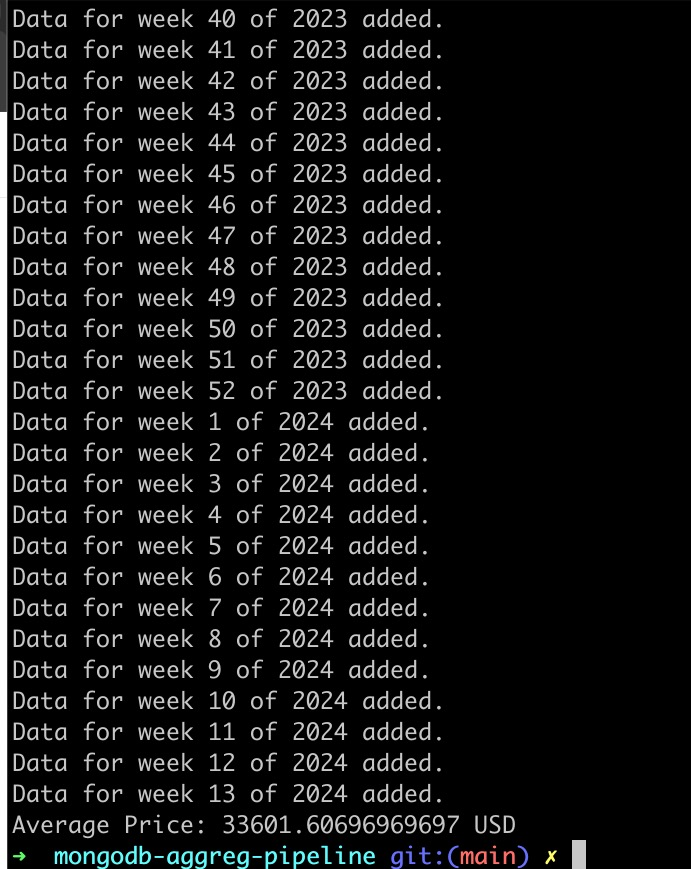

## Simple SP Mongodb aggregation pipeline

## How to run

Start the docker to set up Mongodb

```shell
docker-compose up -- build
```

Run the main code

```shell
go run main.go
```

## Mongo DB aggregation pipeline

Stores the bitcoind prices in USD into MongodDB from coinbase api from
`2023-01-01` to `2024-04-01` and caculates the average price.

To avoid overwhelming coinbase api, I am sleeping for 3 seconds after each
API fetch. But you can change it if you want.

## Aggregation pipeline

`group` groups all the documents by `id` expression. Here `id` is nil
so all documents are grouped together without any distinction as single group.
`avg` calculates the average of the `amount` for each group and here there is
only single group because `id` is nil.

```go
	pipeline := mongo.Pipeline{
		{{"$group", bson.D{{"_id", nil}, {"averagePrice", bson.D{{"$avg", "$amount"}}}}}},
	}
```

## Screenshots


